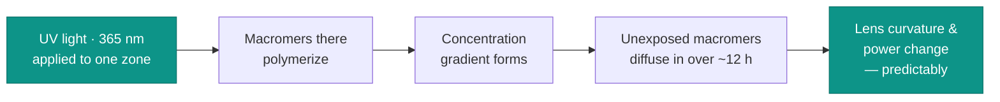
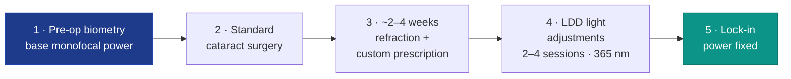

# The Light Adjustable Lens

## Customizing Vision After Cataract Surgery

A non-invasive approach to correcting refractive error **after** the eye has healed

  Cataract & Refractive Surgery

<!--
Speaker notes (≈8-minute talk, ~40 s per slide).

Opening: "Good morning. Today I'll introduce the Light Adjustable Lens — the
first intraocular lens whose power we can fine-tune AFTER surgery, without ever
touching the eye again. I'll cover the problem it solves, how it works, who it's
for, and what the clinical data show."
-->

---
layout: default
---

# The Clinical Problem

Residual refractive error is **one of the most important factors** determining visual acuity after cataract surgery.

<v-clicks>

- **Why it happens** — even with modern surgery, the target is missed because of:
  - Errors in **biometric measurements**
  - Unpredictability of the **effective lens position (ELP)**
  - Individual variation in **wound healing**

- **Today's fixes are invasive** — IOL exchange or corneal laser (LASIK / PRK) carry surgical risk and a long recovery.

- **The unmet need** — a way to correct sphere *and* cylinder **non-invasively**, after the eye is stable.

</v-clicks>

<!--
Set up the "why". Conventional fixed-power IOLs lock in a single prediction at
the time of surgery. If healing or biometry is off, the patient is left with
blur — and correcting it means another operation. Emphasise that residual error
directly drives dissatisfaction in premium cataract surgery.
-->

---
layout: two-cols-header
---

# What Is the Light Adjustable Lens?

A **photoreactive silicone IOL** whose dioptric power can be changed by light *after* implantation.

::left::

<v-clicks>

- Adjusted once the eye has **healed and reached refractive stability**
- Corrects **both sphere and cylinder** (astigmatism)
- Lets us **customize and optimize** the result for each individual patient

</v-clicks>

::right::

<v-clicks>

**A short history**

- **1997** — invented by **Dr. Daniel Schwartz** (UCSF) & **Robert Grubbs** (Caltech chemist, Nobel laureate)
- They built a lens whose 3-D structure can be altered non-invasively by light energy
- **FDA approved for human use — Nov 22, 2017**

</v-clicks>

::bottom::

<!--
The core idea in one sentence: it is a normal-feeling monofocal-style silicone
lens UNTIL we shine light on it, at which point its shape — and therefore the
patient's prescription — changes. Grubbs won the 2005 Nobel Prize in Chemistry
for olefin metathesis; this is genuinely chemistry-driven optics.
-->

---
layout: default
---

# How It Works — Photochemistry + Diffusion

The optic holds light-sensitive **macromers** evenly distributed in a silicone matrix.

**Targeted** — light can correct sphere **and** cylinder at the same time.

**Repeatable** — while untreated macromers remain, the optic can be refined again.

**Predictable** — lens healing is far more uniform than corneal healing.

<!--
Walk the chain left to right. The key insight is the concentration gradient:
polymerising one region pulls free macromers toward it by simple diffusion, which
physically reshapes the optic. Because the material behaves consistently, the
dioptric change is highly predictable — unlike the cornea, which heals
differently in every patient.
-->

---
layout: default
---

# Lock-In & UV Protection

### Locking the power in

<v-clicks>

- Adjustments are repeated until **surgeon and patient are satisfied**
- The **entire optic** is then irradiated → all remaining macromers polymerize
- This **"lock-in"** permanently fixes the lens — no further change is possible

</v-clicks>

### Guarding against stray UV

<v-clicks>

- **ActivShield** — an integrated UV-absorbing layer (2nd generation, 2021)
- Prevents **accidental sunlight** from altering the lens before lock-in
- Patients wear **UV-protective glasses** from surgery until **24 h after** the final treatment

</v-clicks>

Until lock-in, the lens is a "living" optic — protection is essential.

<!--
Two ideas: lock-in is the irreversible commitment step, and until you reach it,
ambient UV (sunlight, even indoor sources) could polymerise macromers
uncontrollably. ActivShield plus the goggles are what make the adjustment window
safe. Compliance with the glasses is non-negotiable.
-->

---
layout: default
---

# Lens Specifications

### Optic

| Property | Value |
|---|---|
| Material | Photoreactive, UV-absorbing silicone |
| Refractive index | 1.43 |
| Diopter range | +10.0 to +30.0 D |
| Edge design | Rounded anterior · square posterior |
| Optic diameter | **6 mm** |
| Overall diameter | 13 mm |

### Haptics

| Property | Value |
|---|---|
| Material | Blue-core PMMA monofilament |
| Haptic angle | 10° |

A densely UV-filtering layer in the **posterior** optic shields the **retina** during every light treatment and lock-in.

<!--
Don't read the whole table — highlight that it is a silicone three-piece lens
with a 6 mm optic (this number matters for dilation later) and a built-in
posterior UV filter to protect the macula during treatments. Diopter steps are
finer (0.5 D) in the common +16 to +24 range.
-->

---
layout: default
---

# The Surgical Workflow

**The Light Delivery Device (LDD)**
An optical projection system + UV source mounted on a slit lamp; light is focused onto the lens through a special corneal contact lens.

**⚠️ Needs ~7 mm dilation**
The optic is 6 mm, so the pupil must open wide enough for UV light to cover the **entire** optical zone.

<!--
Stress the timeline: the patient leaves surgery essentially "undialed", we wait
for stability (~2–4 weeks), then sculpt the prescription over 2–4 quick clinic
visits, and finally lock it in. The whole adjustment course is usually finished
by about 5–6 weeks. The dilation requirement is a real practical gatekeeper —
poor dilators are not good candidates.
-->

---
layout: two-cols-header
---

# Indications & Contraindications

::left::

### ✅ Good candidates

<v-clicks>

- **High risk of refractive surprise** — prior LASIK, PRK or RK, where IOL calculation is uncertain
- **Premium expectations without diffractive multifocals** — works on a monofocal principle, target set post-op
- **Mini-monovision / blended vision** — tested and tuned after surgery
- **Low residual astigmatism** — correctable down to ~0.50 D

</v-clicks>

::right::

### ⛔ Avoid in

<v-clicks>

- Pre-existing **macular disease**
- Prior **ocular herpes** infection
- **UV-sensitizing** drugs, or **retinotoxic** drugs (e.g. **Tamoxifen**)
- **Nystagmus**
- Patients who **cannot comply** with the adjustment schedule or UV-glasses regimen

</v-clicks>

<!--
Frame indications around the headline use case: post-refractive-surgery eyes,
where everyone struggles with IOL power. Contraindications cluster into two
themes — (1) UV/retinal risk, and (2) the ability to physically deliver and
comply with treatment (fixation, dilation, glasses, multiple visits).
-->

---
layout: default
---

# Advantage — Post-Refractive Surgery Eyes

After LASIK / PRK / RK, IOL power calculation is **unreliable** — the LAL corrects the surprise non-invasively.

#### Brierley — 34 eyes, prior refractive surgery

97% · 100%

within **±0.50 D** · within **±1.00 D** of target

≈ 60% more predictable than monofocal IOLs in these eyes

#### Wong & Folden — 2nd-gen LAL, post-LASIK/PRK

82% · 97%

saw **20/20+** · within **±0.50 D** (mean SE 0.01 D)

**vs. corneal laser enhancement** — adjustment can begin at **~3 weeks** (not the ~3-month wait for corneal stabilization), is **more predictable**, **non-invasive**, and improves patient satisfaction.

<!--
This is the strongest clinical story. Post-refractive eyes are the classic
"refractive surprise" population because the altered cornea breaks standard IOL
formulas. The LAL sidesteps the problem entirely by measuring the actual,
healed refraction and dialing the lens to match it. Cite Brierley's ~60% gain in
predictability as the headline number.
-->

---
layout: default
---

# Clinical Outcomes vs. Other IOLs

### Monocular UCDVA ≥ 20/20
*(Nakagama & Doane — 150 eyes)*

| Lens | 20/20 or better |
|---|---|
| **LAL** | **64 %** |
| Toric monofocal | 46 % |
| Spherical monofocal | 32 % |

Within **±0.50 D** of plano: **LAL 92%** vs toric 82% vs spherical 64%. FDA trial (600 eyes): **70% of LAL** reached 20/20 vs 36% of monofocal controls.

### Customized monovision

96%

achieved binocular **20/20 distance + J2 near** *(Folden & Wong)*

**LAL+ (2023)** — adds central power for a **broader depth of focus**: better intermediate & near vision and **less anisometropia**, with no loss of distance acuity.

<!--
The comparative data make the case: the LAL roughly doubles the rate of 20/20
uncorrected vision versus a standard spherical monofocal, and beats toric lenses
on residual error too — because it is tuned to the real post-op refraction
instead of a pre-op prediction. Monovision is a sweet spot: patients trial the
blur in real life before committing. The newer LAL+ widens the range of focus.
-->

---
layout: two-cols-header
---

# Limitations & Safety

::left::

### Limitations

<v-clicks>

- **Premium cost** — plus added service costs for refractions, light sessions, lock-ins
- Needs **adequate dilation** (6.5–7 mm)
- Corneal astigmatism **may drift with age**, affecting long-term result
- Heavily **compliance-dependent** (UV glasses, multiple visits)

</v-clicks>

::right::

### Safety profile

<v-clicks>

- Overall **similar to standard cataract surgery**
- LAL-specific effects are mostly **transient** and UV-related (e.g. temporary red-tinged vision)
- **Secondary surgical intervention: only 1.7%** *(FDA study)*

</v-clicks>

Future direction: pairing the LAL with adaptive-optics to correct aberrations in real time.

<!--
Be balanced. The big practical downsides are cost and the logistical burden of
multiple post-op visits, both of which depend on patient compliance. Safety-wise
the lens behaves like routine cataract surgery; UV side effects (erythropsia,
mild colour shift) are almost always temporary, and the need for further surgery
is rare at 1.7%.
-->

---
layout: center
class: text-center
---

# Key Takeaways

🔧 **The first truly adjustable IOL** — non-invasive refractive fine-tuning *after* surgery

🎯 **Excellent predictability**, especially in post-refractive-surgery eyes

👁️ **Enables customized monovision / blended vision** patients can trial first

⚖️ **Trade-offs** — cost, multiple visits, UV-glasses compliance, adequate dilation

✅ **Safe**, with promising and stable refractive outcomes

<!--
Land the plane: the LAL converts cataract surgery from a one-shot prediction into
an adjustable, patient-in-the-loop refractive process. It shines where prediction
is hardest (post-refractive eyes) and where personalization matters (monovision).
The price is cost and compliance. Invite questions.
-->

---
layout: center
class: text-center
---

# Thank You

Questions?

Sources: Word manuscript (primary) · Jun et al., *Curr Opin Ophthalmol* 2024 · Doane et al., *JCRS* 2025 · Wong & Folden, *Clin Ophthalmol* 2023 · Nakagama & Doane, *Missouri Medicine* 2025

